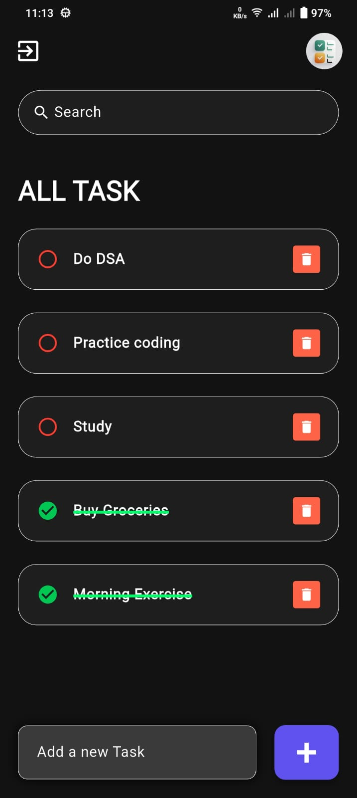

<h1 align="center" style="color:#4CAF50; font-size: 3em;"> TaskBrew</h1>
<h3 align="center" style="color:#888;">Brew Your Productivity, One Task at a Time!</h3>

---

<h2 style="color:#FF5722;"> Description</h2>

<b>TaskBrew</b> is a Flutter-based To-Do application designed to simplify task management. With a clean and intuitive interface, users can easily add, update, and delete tasks—making productivity an everyday habit.

---

<h2 style="color:#3F51B5;"> Features</h2>

<ul>
  <li>✅ Add new tasks</li>
  <li>✏️ Edit existing tasks</li>
  <li>🗑️ Delete tasks with a swipe or button</li>
  <li>📱 Clean, mobile-first user interface</li>
</ul>

---

<h2 style="color:#009688;">🛠 Installation Instructions</h2>

<ol>
  <li><b>Clone the repository:</b>
    <pre><code>git clone https://github.com/harshitsingh070/TaskBrew.git</code></pre>
  </li>
  <li><b>Navigate to the project directory:</b>
    <pre><code>cd TaskBrew</code></pre>
  </li>
  <li><b>Install the dependencies:</b>
    <pre><code>flutter pub get</code></pre>
  </li>
  <li><b>Run the app:</b>
    <pre><code>flutter run</code></pre>
  </li>
</ol>

---

<h2 style="color:#673AB7;">🧪 Usage</h2>

<ul>
  <li>➕ Tap the <b>"Add Task"</b> button to create a new task.</li>
  <li>📝 Tap on a task to edit its title.</li>
  <li>🗑️ Swipe left or right to delete a task, or use the delete icon.</li>
</ul>

---

<h2 style="color:#795548;">💻 Tech Stack</h2>

<table>
  <tr>
    <th>Technology</th>
    <th>Description</th>
  </tr>
  <tr>
    <td>🐦 Flutter</td>
    <td>Cross-platform UI toolkit for building natively compiled apps</td>
  </tr>
  <tr>
    <td>🎯 Dart</td>
    <td>Programming language optimized for UI development</td>
  </tr>
</table>

---

<h2 style="color:#607D8B;">📸 Screenshots</h2>

<h3>🏠 Home Screen</h3>

  

---

<h2 style="color:#9C27B0;">🤝 Contributing</h2>

Contributions are welcome! Feel free to fork the repository and submit a pull request. For major changes, open an issue first to discuss what you'd like to change.

---

<h2 style="color:#FF9800;">📄 License</h2>

This project is licensed under the MIT License. See the <a href="LICENSE">LICENSE</a> file for more information.

---

<h2 style="color:#00BCD4;"> Contact</h2>

📧 Email: <a href="harshitsingh2807@gmail.com">your-email@example.com</a>  
🌐 GitHub: <a href="https://github.com/harshitsingh070">@harshitsingh070</a>

---

⭐ If you like this project, don’t forget to star it on GitHub!

